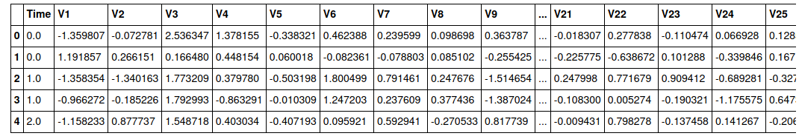
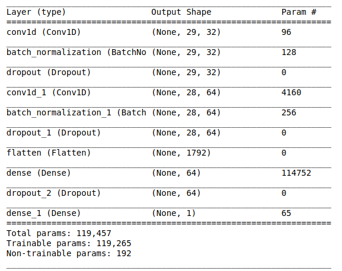
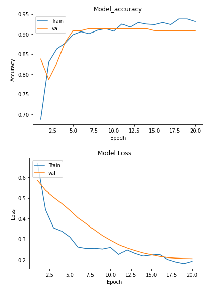
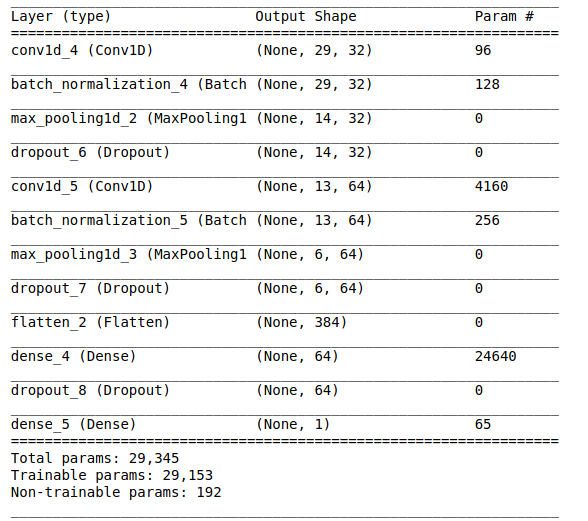
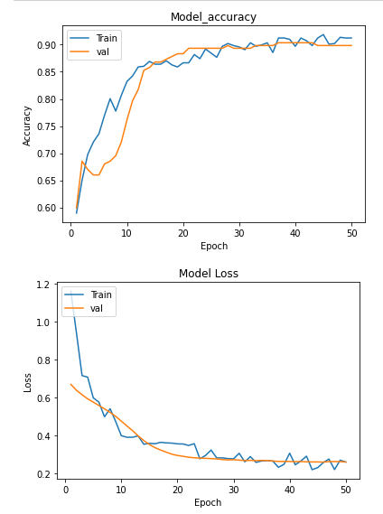
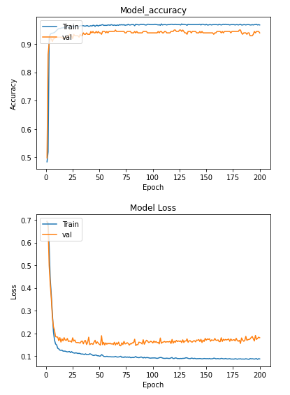

# Credit Card Fraud Detection using CNN

## Dataset
https://www.kaggle.com/mlg-ulb/creditcardfraud

## Model without Maxpool
 

## loss and accuracy of the model without maxpool

## Model with Maxpool

## loss and accuracy of the model with maxpool

## ANN MODEL
Accuracy: train =99% test=93.7%

